TEMA   Java Swing
Diseño e implementación de interfaces gráficas en Java Swing utilizando diferentes componentes (JTextField, JRadioButton, JCheckBox, JLabel y JOptionPane).

ENTORNO

Revisar como llegar a utilizar los formularios

FORMULARIO 1 — Operaciones Matemáticas (JTextField)
Tema:
Cálculo de operaciones matemáticas básicas con Java Swing.
Indicaciones:
• Crear una ventana con tres JTextField: valor 1, valor 2 y resultado.
• El estudiante podrá realizar: suma, resta, multiplicación y división.
• El resultado se debe mostrar en la tercera caja de texto.
• Los botones deben ser: Sumar, Restar, Multiplicar, Dividir.
• Validar que los datos ingresados sean numéricos.
• Aplicar un diseño agradable.

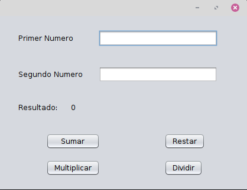

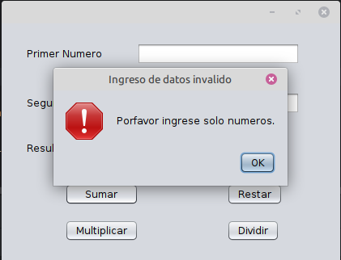

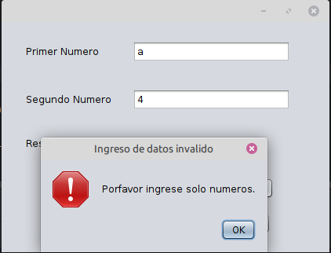

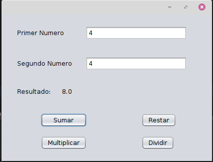

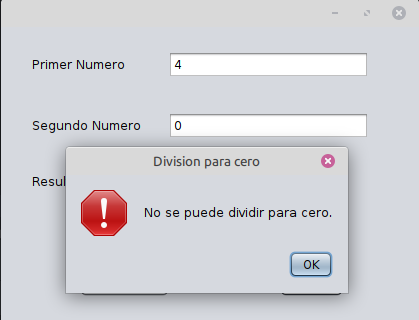

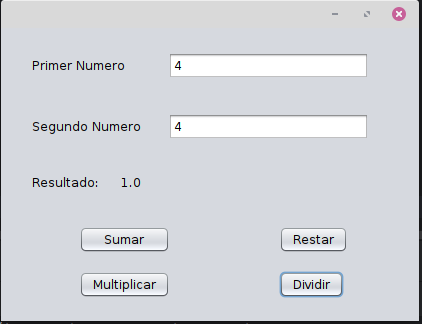

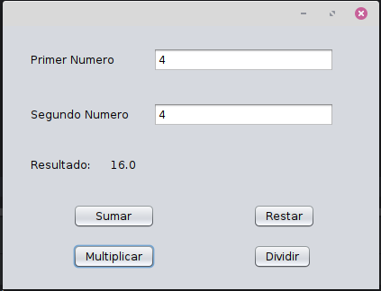

FORMULARIO 2 — Encuesta de Tres Preguntas (RadioButton)
Tema:
Encuesta rápida utilizando botones de selección única (JRadioButton).
Indicaciones:
• Crear una ventana con tres preguntas.
• Cada pregunta debe tener tres opciones usando JRadioButton.
Ejemplo:
◦ ¿Deseas seguir una maestria?
▪ Sí
▪ A veces
▪ No
• Usar ButtonGroup para que solo se pueda seleccionar una respuesta por pregunta.
• Incluir un botón: “Enviar respuestas”.
• Mostrar el resumen de la encuesta en un JLabel o en un JOptionPane.
• Diseño visual ordenado y agradable.

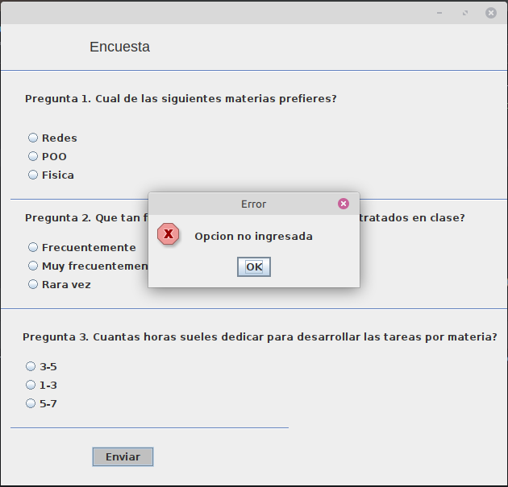

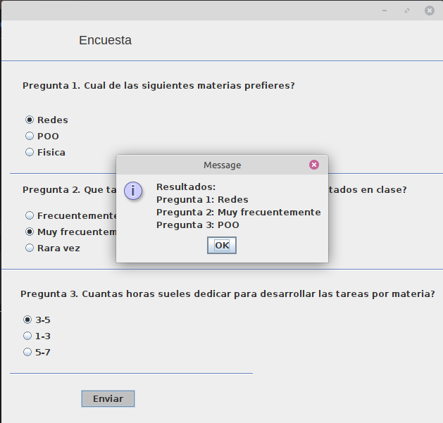

FORMULARIO 3 — Formulario con CheckBox
Tema:
Selección múltiple de intereses utilizando JCheckBox.
Indicaciones:
• Crear una ventana con un texto:
“Seleccione sus intereses o preferencias”.
• Agregar varios JCheckBox, por ejemplo:
◦ Programación
◦ Redes
◦ Base de Datos
◦ Diseño
◦ Seguridad Informática
• El usuario puede marcar una o varias opciones.
• Incluir un botón “Procesar selección”.
• Mostrar el resultado en un JOptionPane o en un JLabel, indicando cuáles checkboxes fueron seleccionados.
• Dar diseño estético y limpio.

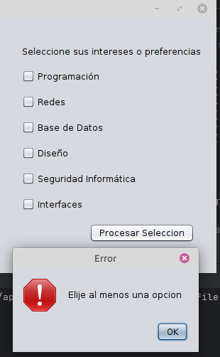

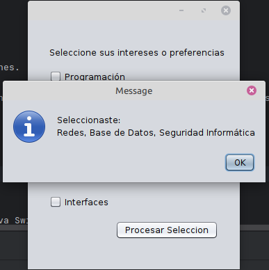

Objetivo de las tres ventanas
Aplicar el uso de componentes gráficos de Java Swing para:
• Captura de datos
• Selección única (RadioButton)
• Selección múltiple (CheckBox)
• Cálculo y procesamiento de información
• Presentación de resultados con JTextField, JLabel y JOptionPane
Subir al Github

