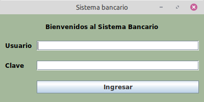
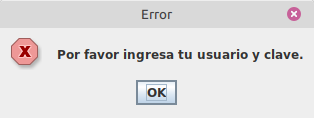
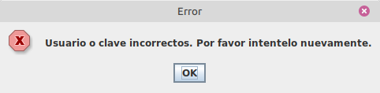
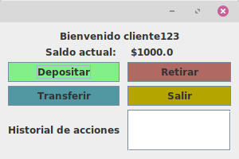
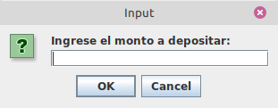
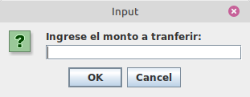
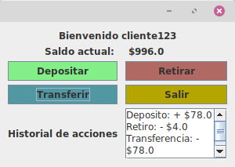
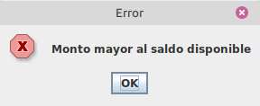
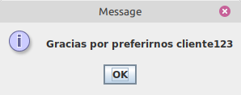
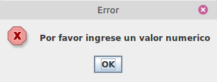

Tarea Java Swing – Simulador Bancario Interactivo
Objetivo General
Desarrollar una aplicación en Java utilizando Swing, que permita a un usuario ingresar con su nombre de usuario y contraseña, y realizar operaciones bancarias como depósito, retiro y transferencia, visualizando siempre el saldo actualizado y evitando operaciones inválidas.
Parte 1: Inicio de Sesión (Login)
1. Crear un formulario llamado LoginForm con los campos:
    - Usuario (JTextField)
    - Contraseña (JPasswordField)
    - Botón “Ingresar”

2 Validar credenciales predefinidas:
- Usuario: cliente123
- Contraseña: clave456

3. Si las credenciales coinciden, mostrar la ventana principal de operaciones (BancoForm), ocultando la pantalla de login.
   Parte 2: Operaciones Bancarias (Ventana Principal)
   Formulario: BancoForm
   Requisitos:
- Mostrar el nombre del cliente y el saldo actual (valor inicial: $1000.00).
- Incluir botones para:
    - Depósito
    - Retiro
    - Transferencia
    - Salir

Detalles por botón:
•  Depósito
- Solicitar valor a depositar (JOptionPane o formulario pequeño).
- Sumar el valor al saldo.
- Mostrar mensaje de confirmación.
- Actualizar saldo en pantalla.
  •  Retiro
- Solicitar valor a retirar.
- Verificar que el saldo sea suficiente.
- Si es válido, restar el valor. Si es mayor al saldo, mostrar advertencia y no hacer nada.
- Actualizar saldo en pantalla.
  • Transferencia
- Solicitar:
    - Nombre del destinatario (JTextField)
    - Monto a transferir
- Verificar que el monto no supere el saldo.
- Restar del saldo si es válido.
- Mostrar mensaje “Transferencia exitosa a [Nombre] por $[monto]”.
  • Después de cada transacción:
- Actualizar el saldo.
- Mostrar en un área de texto (JTextArea o JLabel) el historial de transacciones.
  Extras para Buen Diseño
- Uso de GroupLayout o GridBagLayout para una interfaz clara y ordenada.
- Íconos o colores para cada botón de operación.
- Estilo profesional: fuentes legibles, espacios adecuados y centrado visual.
  Entregables
- Proyecto completo en IntelliJ
- Archivos .java bien organizados en paquetes:
    - forms (para LoginForm y BancoForm)
    - model (opcional: para manejo del cliente o transacciones)
- Capturas de pantalla del funcionamiento.
- Explicación breve en un archivo Word de cómo funciona el sistema.
  SUBIR EL  GITHUB

