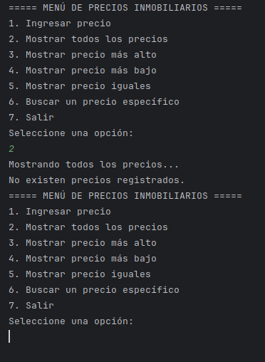
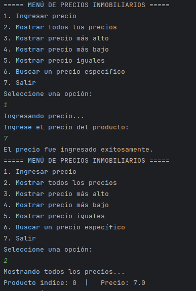
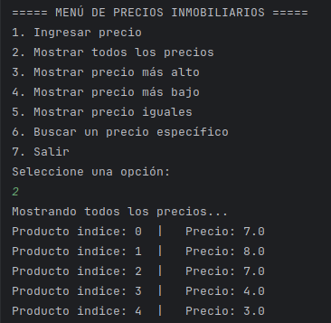
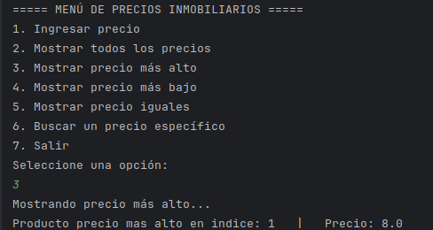
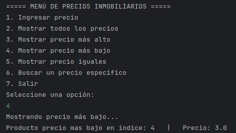
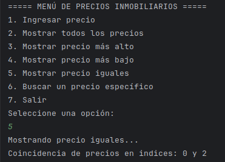
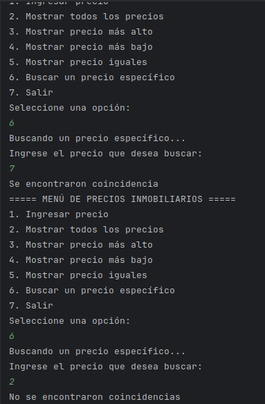
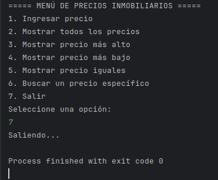

EJERCICIO #1
Manejo de ArrayList en Java Tema:
Gestión de precios de casas y departamentos usando colecciones en Java.
Objetivo:
Aplicar el uso de ArrayList, ciclos, métodos y estructuras de control mediante la construcción de un programa con menú interactivo en consola.
Enunciado de la Actividad
Desarrolle un programa en Java y Modelar UML que permita gestionar los precios de casas y departamentos. Para ello, realice lo siguiente:
1. Estructura de Datos
◦ Utilice un ArrayList<Double> para almacenar los precios ingresados por el usuario.
2. Menú Principal
El sistema debe presentar un menú en consola con las siguientes opciones:
===== MENÚ DE PRECIOS INMOBILIARIOS =====
1. Ingresar precio
2. Mostrar todos los precios
3. Mostrar precio más alto
4. Mostrar precio más bajo
5. Mostrar precio iguales
6. Buscar un precio específico
7. Salir
Seleccione una opción:

    3. Funcionalidades a implementar

Opción 1: Ingresar precio
◦ Solicitar al usuario un valor numérico (double).
◦ Agregar el valor al ArrayList.
◦ Validar que sea un número mayor que cero.

Opción 2: Mostrar todos los precios
◦ Mostrar cada precio almacenado.
◦ Si no hay precios, mostrar el mensaje: "No existen precios registrados."

Opción 3: Mostrar el precio más alto
◦ Recorrer el ArrayList para obtener el valor máximo.
◦ Mostrar el resultado.
◦ ​
Opción 4: Mostrar el precio más bajo
◦ Recorrer el ArrayList para obtener el valor mínimo.
◦ Mostrar el resultado.

Opción 5: Mostrar el precio iguales
◦ Recorrer el ArrayList para obtener el valor igual.
◦ Mostrar el resultado.

Opción 6: Buscar un precio
◦ Pedir un precio al usuario.
◦ Verificar si ese precio existe en el ArrayList usando contains.
◦ Mostrar un mensaje indicando si se encontró o no.

Opción 7: Salir
◦ Finaliza el programa.

Indicaciones
1. Crear una clase principal llamada GestionPrecios.
2. Declarar un ArrayList<Double> para almacenar los precios.
3. Implementar un menú repetitivo usando while o do-while.
4. Usar Scanner para ingresar datos.
5. Validar que los precios ingresados sean positivos.
6. Utilizar métodos para organizar mejor el código (opcional):
◦ ingresarPrecio()
◦ mostrarPrecios()
◦ precioMasAlto()
◦ precioMasBajo()
◦ precioIguales()
◦ buscarPrecio()
7. Probar el programa ingresando al menos 5 precios distintos.

