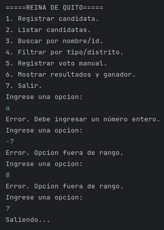

    4. Ejercicio propuesto: Sistema — Elección de la Reina de Quito
Descripción general:
Desarrollar un programa Java en consola para gestionar candidatas a la elección de la Reina de Quito. El sistema debe permitir registrar candidatas, simular votaciones, mostrar resultados y usar herencia, polimorfismo, excepciones personalizadas y ArrayList.

Requerimientos funcionales
1. Clase abstracta Candidata
◦ Atributos: int id, String nombre, int edad, String distrito, double puntajeJurado
◦ Método abstracto public abstract void mostrarDetalles();
2. Clases hijas (dos ejemplos; puedes crear otras variantes):
◦ CandidataEstudiante (atributos adicionales: String universidad, String carrera)
◦ CandidataProfesional (atributos adicionales: String profesion, int añosExperiencia)
◦ Ambas sobrescriben mostrarDetalles() (polimorfismo).
3. Excepción personalizada DatoInvalidoException
◦ Lanzarla si nombre vacío, edad <= 0 o puntajes negativos, etc.
4. Gestión con ArrayList<Candidata>
◦ Registrar candidatas, eliminar, editar, listar.
◦ Búsqueda por nombre o id.
◦ Filtrado por tipo (Estudiante / Profesional / otros).
5. Simulación de votación
◦ Implementar ArrayList<Voto> o un Map<Integer, Integer> para contar votos por idCandidata.
◦ Menu para “votar” (simulación) y opción para importar votos de muestra.
◦ Mostrar ganador(es). Manejar empates (desempate por puntajeJurado).
6. Validaciones
◦ Datos obligatorios no vacíos.
◦ Edad positiva (>= 16, por ejemplo).
◦ Puntaje jurado en rango 0–100.
◦ Atrapar excepciones y mostrar mensajes claros.
7. Interfaz de consola (menú)
◦ Registrar candidata.
◦ Listar todas.
◦ Buscar por nombre/id.
◦ Filtrar por tipo/distrito.
◦ Simular voto / registrar voto manual.
◦ Mostrar resultados y ganador.
◦ Salir.
8. Pruebas
◦ Ingresar al menos 5 candidatas (mezcla de tipos) y simular votos para demostrar resultados y manejo de errores.

Modelo UML (textual — debes entregar diagrama gráfico)
Clases principales y relaciones:
• Candidata (abstract)
◦ - id: int
◦ - nombre: String
◦ - edad: int
◦ - distrito: String
◦ - puntajeJurado: double
◦ + get/set ...
◦ + mostrarDetalles(): void (abstract)
• CandidataEstudiante extends Candidata
◦ - universidad: String
◦ - carrera: String
◦ + mostrarDetalles(): void (override)
• CandidataProfesional extends Candidata
◦ - profesion: String
◦ - añosExperiencia: int
◦ + mostrarDetalles(): void (override)
• Voto
◦ - idVoto: int
◦ - idCandidata: int
◦ - fechaHora: LocalDateTime
• Concurso (o Eleccion)
◦ - listaCandidatas: ArrayList<Candidata>
◦ - votos: ArrayList<Voto> (o Map<Integer,Integer> conteoVotos)
◦ + registrarCandidata(Candidata c): void
◦ + votar(int idCandidata): void
◦ + contarVotos(): Map<Integer,Integer>
◦ + obtenerGanador(): List<Candidata>
• Main
◦ Controla menu y flujo
Relaciones: Concurso usa Candidata y Voto. Herencia Candidata <- CandidataEstudiante/Profesional.

Reglas de validación (ejemplos concretos)
• nombre no puede estar vacío → DatoInvalidoException.
• edad >= 16 → excepción si menor.
• puntajeJurado entre 0 y 100 → excepción si fuera de rango.
• distrito no vacío.

Entregables esperados
1. Código Java completo (compilable y ejecutable).
2. UML en imagen (PNG/PDF).
3. README en GitHub con:
◦ Enunciado,
◦ Instrucciones para ejecutar,
◦ Capturas de pantalla de la ejecución,
◦ Ejemplos de entrada/salida.
4. Capturas de pruebas (registro de 5+ candidatas y simulación de votación).
5. (Opcional) Archivo ZIP del proyecto.

Criterios de evaluación sugeridos (rubrica breve)
• Funcionalidad (40%): cumple requisitos principales (registro, votación, ganador).
• POO (25%): uso correcto de herencia, polimorfismo, encapsulamiento.
• Validaciones y excepciones (15%): manejo de errores con DatoInvalidoException.
• Documentación / UML / README (10%).
• Código limpio / comentarios (10%).

Prueba menu:
Casos Excepcionales(letras, numero fuera de rango y salida)

Opcion 1